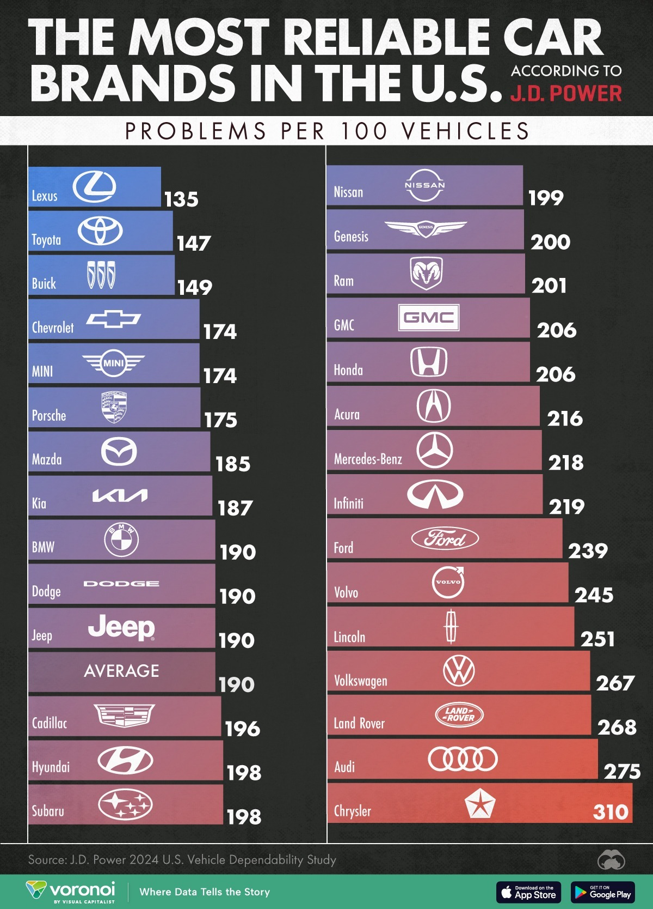
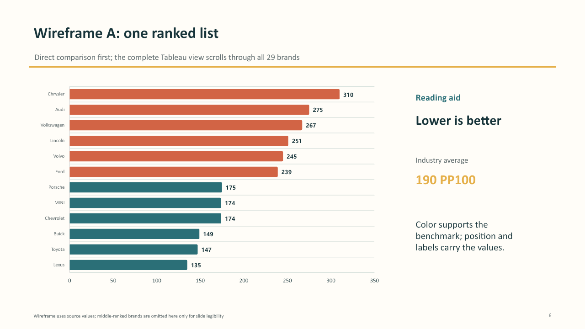
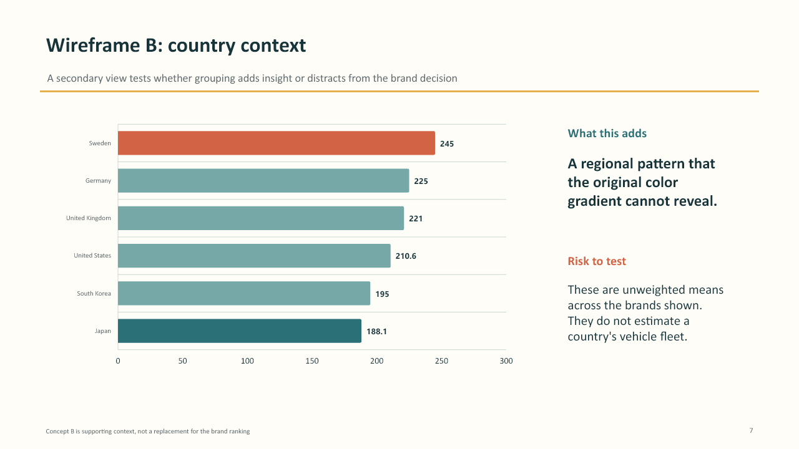

| [home page](./) | [data viz examples](dataviz-examples) | [critique by design](critique-by-design) | [final project I](final-project-part-one) | [final project II](final-project-part-two) | [final project III](final-project-part-three) |

# Redesigning a Car-Brand Dependability Ranking

## Project overview

For this project, I critiqued and redesigned Visual Capitalist's **“Ranked: The Most Reliable Car Brands in the U.S.”** The original visualization reports the number of problems per 100 vehicles (PP100) from the 2024 J.D. Power U.S. Vehicle Dependability Study. **Lower PP100 is better**, and the reported industry average is **190 PP100**.

I selected this visualization because it is polished and immediately engaging, but it also contains a meaningful design problem: a two-column layout interrupts a single ordered ranking. This made it a useful case for testing whether a simpler layout, a more explicit benchmark, and clearer explanatory text could improve comprehension without losing the strengths of the original.

- [Original Visual Capitalist article and visualization](https://www.visualcapitalist.com/ranked-the-most-reliable-car-brands-in-the-u-s/)
- [Step 3 Tableau Public prototype](https://public.tableau.com/app/profile/shreyas.anand4069/viz/Car_Brand_Dependability_Step3/ConceptA-RankedBrands)
- [Final peer-reviewed visualization on Tableau Public](https://public.tableau.com/app/profile/shreyas.anand4069/viz/Car_Brand_Dependability_Peer_Reviewed/ConceptA-RankedBrands)
- [Download the final Tableau workbook](assets/car-dependability/final-workbook.twbx)
- [Download the source-data table (CSV)](assets/car-dependability/car_brand_dependability_2024.csv)

Use the links above to compare the initial prototype with the final design. The final interactive workbook is embedded in Step 5 below; its tabs switch between the ranked brands and the country map.

## Step 1 — Original visualization

### What the original does well

- It uses a familiar horizontal bar chart and direct PP100 labels.
- Brand names and logos make the subject immediately recognizable.
- The blue to red color progression helps viewers see a good-to-bad performance pattern.
- The 190 PP100 industry average supplies an important benchmark.
- The subject is relevant to car shoppers and invites readers to locate familiar brands.

### My first impressions and concerns

The graphic initially felt attractive, familiar, and easy to enter. I could quickly identify Lexus, Toyota, and Buick as the best-performing brands in the displayed study and Chrysler as the worst-performing brand. However, the two-column layout made the ordered list harder to follow: the eye has to finish the left column and restart at the top of the right column. The industry average also looked like another ranked row rather than a benchmark.

The title says 'most reliable', but the measure is actually reported problems per 100 vehicles. The display does not plainly state that lower is better. It also omits important study context, including the respondent sample, vehicle model year, field dates, and the fact that PP100 counts reported problems without showing their severity or repair cost.

## Step 2 — Structured critique

I completed and submitted the required Google Form using the critique responses summarized here. [Retained critique responses](car-dependability-critique-responses) provide the full observations and rating rationales.

I used Stephen Few's Data Visualization Effectiveness Profile to separate different dimensions of effectiveness instead of relying on a general like/dislike judgment.

| Criterion | Rating | Rationale |
|---|---:|---|
| Usefulness | 8/10 | The ranking and benchmark address a question that matters to car shoppers, but they cannot support model-level decisions. |
| Completeness | 6/10 | Exact values and the industry average are present, but sample, timing, model year, metric direction, and key limitations are absent. |
| Perceptibility | 6/10 | Bars and labels work, but the two column split interrupts comparison and large logos compete with the data. |
| Truthfulness | 8/10 | Values and bar lengths match the cited table, but limited context can encourage overgeneralization. |
| Intuitiveness | 6/10 | The chart form is familiar, but “lower is better” is unstated and the average resembles a brand row. |
| Aesthetics | 9/10 | Typography, color, spacing, and brand imagery are cohesive and appealing. |
| Engagement | 8/10 | Familiar brands and a consumer topic attract interest, although the static graphic offers limited exploration. |

### Audience

The primary audience appears to be US car shoppers and general-interest readers seeking a quick brand level dependability signal. The original is effective as an introduction, but it should not be treated as a prediction for every vehicle. A shopper would need model level evidence, problem severity, repair costs, and other information before making a purchase decision.

### What the critique framework revealed

Few's framework was helpful because it showed that a visualization can be aesthetically strong and engaging while still being less complete, perceptible, and intuitive. Its numerical scales should not be treated as precise measurements, and some categories—especially perceptibility and intuitiveness—overlap. The framework also does not explicitly score accessibility, uncertainty, ethics, mobile readability, or decision support.

Compared with the Good Charts method, Few's profile is stronger as a detailed diagnostic tool for an existing visualization. Good Charts is more useful earlier, when defining the audience, purpose, and whether a visual should be exploratory or declarative. I would use Good Charts to frame the problem and Few's profile to evaluate the result.

## Step 3 — Design concepts

[Explore the interactive Step 3 prototype](https://public.tableau.com/app/profile/shreyas.anand4069/viz/Car_Brand_Dependability_Step3/ConceptA-RankedBrands). The two sketches below record the concepts prepared for peer testing. The projected brand sketch shows a subset for legibility and the workbook includes all 29 brands.

### Concept A: one continuous ranked list

The first concept places every brand in one sorted horizontal list. It keeps direct values, states that lower is better, and distinguishes performance relative to the 190 PP100 benchmark. My hypothesis was that viewers would identify the best and worst brands and interpret the benchmark faster than in the original two-column graphic.

### Concept B: country context

The second concept tested a secondary country level comparison using the **unweighted mean PP100 across the brands shown**. It was intended as supporting context, not a replacement for the brand ranking. These values do not estimate the dependability of a country's vehicle fleet, and they should not be interpreted as respondent-weighted national measures.

## Step 4 — Peer testing

I shared the two redesign concepts with **three classmates** during the in class critique and collected the feedback summarized below. The participants are anonymous classmates (Participants A, B were from MSPPM program, and C was from MISM BIDA 16). My retained notes combine their suggestions and they do not preserve which person made each comment, so I report the feedback as a group synthesis rather than reconstruct individual quotations.

The prepared interview script used these prompts:

1. What do you think this visualization is about?
2. What does PP100 mean, and is a lower or higher value better?
3. Which brands stand out, and why?
4. What feels surprising or confusing?
5. Which concept helps answer the main question faster?
6. What would you change before the final build?

### Feedback captured

| Prompt | Peer feedback | What I learned |
|---|---|---|
| What worked? | Establishing the 190 threshold and giving brands on different sides of it distinct visual treatment. | The benchmark was the clearest improvement and should remain prominent. |
| What did not work? | The redesign should retain brand labels and the bar-intensity cue that made the original easy to recognize and scan. | Simplification should not remove useful orientation or familiar visual cues. |
| What questions came up? | Concept B had too much white space; peers wanted the 190 threshold retained and suggested using a world map instead. | The secondary view needed a form that matched the geographic question and used the available space more purposefully. |
| What new inspiration arose? | Apply the changes documented on the presentation's feedback slide and review examples on Data Viz Project. | Chart selection should be justified by the audience's comparison task, not novelty alone. |

### Patterns and differences

The clearest pattern was that peers valued the **190 PP100 benchmark** because it converted isolated values into a meaningful comparison. They also preferred retaining recognizable brand labels and a visible performance distinction. The main criticism focused on Concept B's excess white space and the suggestion to use a world map. My interpretation was that its geographic grouping could be communicated more directly. This feedback did not reject country context entirely; it suggested a more appropriate visual form.

### How testing changed the design

| Peer observation | Final design decision |
|---|---|
| The 190 threshold worked. | Added a visible 190 PP100 reference line to the primary ranked chart and repeated the benchmark in the subtitle. |
| Brand labels and bar intensity were useful in the original. | Kept all brand labels, direct PP100 values, horizontal bars, sorted position, and a restrained performance color distinction. |
| Concept B had too much white space. | Replaced the country bar concept with a filled world map that uses the geographic canvas more intentionally. |
| The country view needed clearer context. | Added a title and subtitle stating that color represents the unweighted mean PP100 across the listed brands and that lower is better. |
| The benchmark should remain central. | Kept the benchmark in the primary decision view instead of implying that the map's unweighted country means are directly comparable with the study's industry average. |

## Step 5 — Final redesign

The final workbook contains two sheets. Select **Concept A - Ranked Brands** or **Concept B - Country Context** in the tabs to switch views. Hover over marks for details.

<iframe title="Final car-brand dependability visualization: ranked brands and country map" src="https://public.tableau.com/views/Car_Brand_Dependability_Peer_Reviewed/ConceptA-RankedBrands?:embed=yes&:showVizHome=no&:tabs=yes&:toolbar=yes" width="100%" height="900" style="border:0;" loading="lazy" allowfullscreen></iframe>

[Open the final visualization in a full browser window](https://public.tableau.com/app/profile/shreyas.anand4069/viz/Car_Brand_Dependability_Peer_Reviewed/ConceptA-RankedBrands).

### Final view A: ranked brands

The primary view is titled **“Car Brand Dependability: Problems per 100 Vehicles.”** It presents one continuous horizontal ranking, shows the brand and exact PP100 value, states **“Lower is better,”** and uses a 190 PP100 reference line. Color supports the benchmark, while bar position and labels carry the comparison.

This view answers the main audience question directly. Lexus has the fewest reported problems at **135 PP100**, followed by Toyota at **147** and Buick at **149**. Chrysler has the most at **310 PP100**. BMW, Dodge, and Jeep sit exactly at the **190 PP100** benchmark.

### Final view B: geographic context

The secondary view is titled **“Where Are the Listed Car Brands Based?”** It replaces the initial country bars with a filled world map. Color encodes the unweighted mean PP100 among the listed brands from each country, and the subtitle clearly states the aggregation and that lower is better.

The listed-brand means are Japan **188.13**, South Korea **195.00**, United States **210.60**, United Kingdom **221.00**, Germany **225.00**, and Sweden **245.00**. These values are descriptive only. Country sample sizes differ substantially—Sweden has one listed brand, while the United States has ten—so the map should not be read as a fair national ranking or a fleet-level estimate.

### Why I selected this final direction

The ranked bar chart remains the main view because horizontal bars are well suited to categorical comparison and accommodate long brand labels. The choropleth map is kept as optional context because the secondary question is explicitly geographic. Data Viz Project describes horizontal bars as useful for comparing categorical values and as especially helpful when labels are long; it describes choropleth maps as appropriate for showing how a statistical variable varies across geographic areas. Those principles supported the final chart choices, while peer feedback determined which view should remain primary.

The final redesign emphasizes explicit reading guidance. It preserves what worked in the original—labels, values, bars, and a performance cue—while fixing the reading order, clarifying metric direction, separating the benchmark from the data rows, and being transparent about the country aggregation.

## Data, methodology, and limitations

- J.D. Power surveyed **30,595 original owners** of 2021 model-year vehicles after three years of ownership.
- The study was fielded from **August through November 2023**.
- PP100 counts reported problems per 100 vehicles; lower is better.
- PP100 does not communicate problem severity, repair cost, or the number of repair visits.
- Brand-level values do not predict every model or every individual vehicle.
- Tesla did not meet J.D. Power's award criteria and was excluded from the Visual Capitalist table used for this redesign.
- Country means in the secondary view are unweighted across the listed brands and are not national fleet estimates.

## Reflection on the process

The critique led me from an attractive but fragmented ranking to a design centered on two reading tasks: locating a brand and comparing it with the industry benchmark. Peer testing then helped me preserve the useful labels and performance cues while changing the country comparison into a map. The result uses the same 29 brand-level PP100 values; the country view is an additional aggregation of those values, not a new dataset.

The final view still has tradeoffs. A long ranking can require scrolling, and the pale colors and small value labels may be harder to read on a projector or small screen. The map makes geography recognizable but is less precise for comparing values and gives large countries more visual area. A future round of testing would check unprompted interpretation of PP100, benchmark use, label legibility, and whether the map adds useful context. These are remaining questions, not claims of measured improvement.

## Accessibility and responsible interpretation

The final ranked view does not depend on color alone: brand names, ordered position, bar length, direct values, explanatory text, and the benchmark line all carry meaning. The map should be treated as supporting context because color-area comparisons are less precise and country-level sample sizes differ. The workbook's titles and notes make the direction of the measure and the aggregation explicit.

## Sources

1. [Visual Capitalist — Ranked: The Most Reliable Car Brands in the U.S.](https://www.visualcapitalist.com/ranked-the-most-reliable-car-brands-in-the-u-s/)
2. [J.D. Power — 2024 U.S. Vehicle Dependability Study](https://www.jdpower.com/business/press-releases/2024-us-vehicle-dependability-study-vds)
3. [Stephen Few — Data Visualization Effectiveness Profile](https://www.perceptualedge.com/articles/visual_business_intelligence/data_visualization_effectiveness_profile.pdf)
4. [Data Viz Project — Horizontal Bar Chart](https://datavizproject.com/data-type/bar-chart-horizontal/)
5. [Data Viz Project — Choropleth Map](https://datavizproject.com/data-type/choropleth-map-2/)

## Process materials

- [Step 2 critique responses and rating rationales](car-dependability-critique-responses)
- [Prepared presentation and peer-testing script (PDF)](assets/car-dependability/presentation-script.pdf)

## AI-use disclosure

I used ChatGPT to help me refine my writeup for this assignment. Once I was done with improved design after the peer feedback, I let Copilot critique my design and suggest any improvements. Lasty gave the assignment rubrics to ChatGPT and asked it to check if all deliverables have met.

[Back to my portfolio](./)
