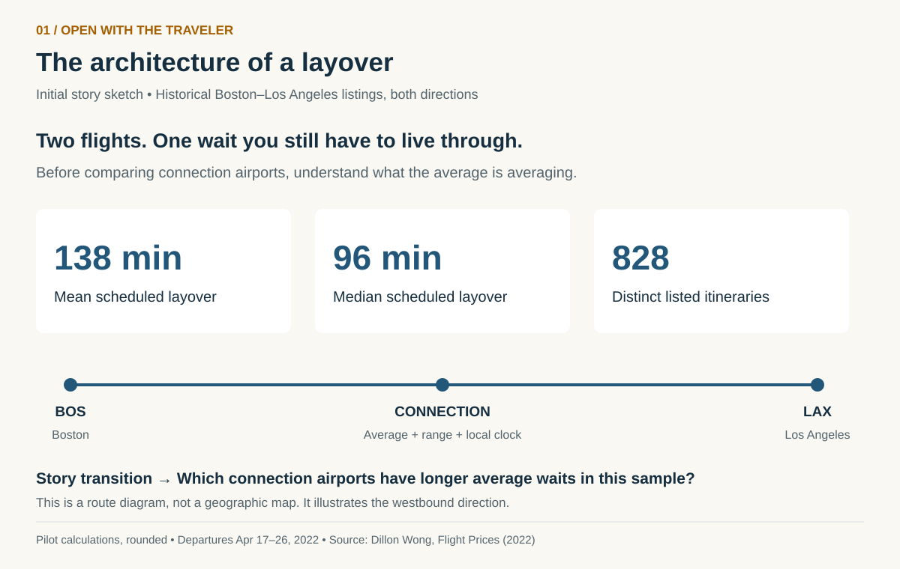
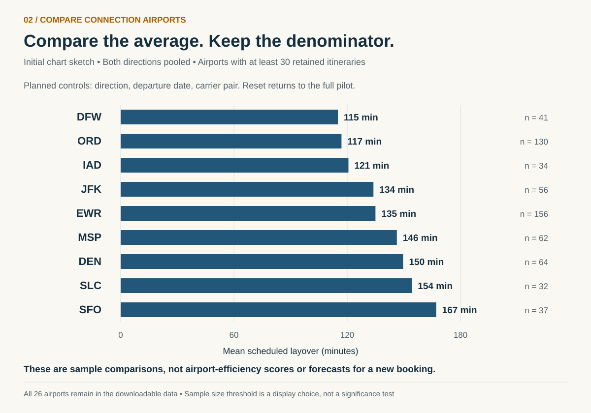
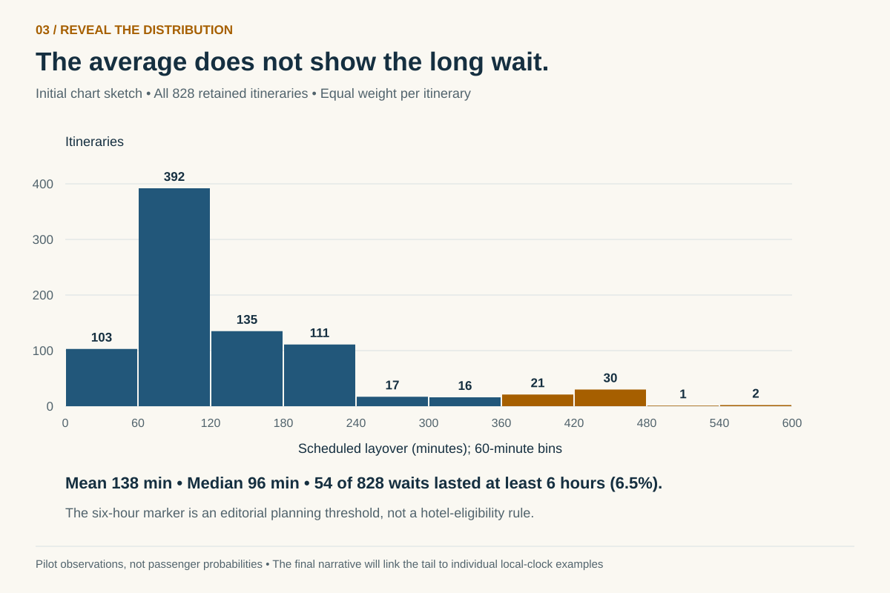
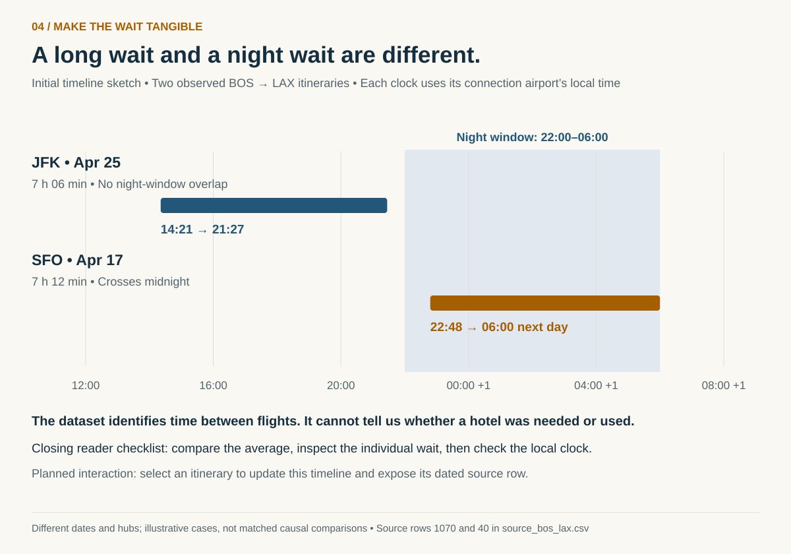

| [home page](https://anandshrey.github.io/Shreyas-Anand-portfolio/) | [data viz examples](dataviz-examples) | [critique by design](critique-by-design) | [final project I](final-project-part-one) | [final project II](final-project-part-two) | [final project III](final-project-part-three) |

# The Architecture of a Layover
## Part I: What an average wait hides

**Shreyas Anand · Telling Stories with Data · September 21, 2026**

**Research question:** Among the one-stop Boston–Los Angeles itineraries in a historical flight-search sample, how does average scheduled layover duration differ by connection airport, and what does that average hide about long waits and overnight timing?

[Outline](#outline) · [Initial sketches](#initial-sketches) · [The data](#the-data) · [Method and medium](#method-and-medium) · [References](#references)

## Outline

### High-level summary

A connecting journey contains a second trip: the time spent between flights. I want to make that usually overlooked interval visible. My project will compare **average scheduled layover duration** at connection airports on one specific coast-to-coast market, Boston Logan (BOS) and Los Angeles International (LAX), in both directions. The intended audience is occasional travelers, including students, who understand flight duration but may not examine the time and local-clock implications of a connection. The story will start with an average, show how it varies across airports, and then reveal the individual waits that an average compresses into one number.

The working data already supports a useful opening: across 828 retained one-stop itineraries, the mean scheduled layover is approximately **138 minutes**, while the median is **96 minutes**. A distribution and two local-time timelines will help readers understand why a roughly two-hour average does not describe every journey. The final experience will be a guided Shorthand narrative with embedded Tableau visualizations, ending with a practical prompt: compare the average, inspect the actual connection, and check the local clock before planning how to spend the wait. These are historical advertised schedules, not measured passenger experiences or current booking recommendations.

### How the original idea became a feasible project

My initial idea considered domestic versus international hubs, overnight hotels, and October–November travel. I am keeping the central question about **average layover duration**, while narrowing the empirical study to an accessible dataset and a consistent origin–destination pair. The downloaded pilot covers departures **April 17–26, 2022**, as listed in the initial April 16 search-date block. It does not establish an October–November peak, international averages, or deliberate airline engineering of overnight gaps. Those claims would require additional evidence. International hotel policies can supply a clearly separated context note; they will not be treated as layover observations or used to explain the domestic sample.

This is an original use of flight-listing data to investigate the connection itself, rather than reproducing a fare-prediction analysis. The narrower route also gives the audience a concrete decision instead of a broad ranking of the world’s airports.

### Audience, user stories, and intended takeaway

**Audience:** occasional travelers comparing one-stop coast-to-coast journeys, especially people who may need to plan meals, work, rest, or an overnight stay during a connection. They need a short explanation before an exploratory chart, not an operational airline dashboard.

- **As a reader, I want to compare average layover durations at the connection airports in this sample so that I can understand how much of a journey may be spent waiting.** I can do this through a labeled airport comparison with a route-direction control and visible itinerary counts.
- **As a reader, I want to see the spread behind the average so that I do not mistake a mean for the duration of my own connection.** I can do this by moving from the comparison to a distribution and an individual itinerary.
- **As a reader, I want to see a connection on the local clock so that I can recognize when a wait reaches into the night.** I can do this through a timeline with arrival, departure, and a labeled night window.

**One-sentence story:** An average layover is a useful starting point, but its distribution and local timing reveal the wait a traveler actually has to plan around.

### Project structure and story arc

| Story beat | What the reader sees | Purpose and transition |
|---|---|---|
| 1. Set up: “Two flights. One wait.” | A simple journey diagram and the pilot’s mean, median, and sample count. | Introduce the connection as part of the journey and define exactly what is being averaged. Ask where these waits differ. |
| 2. Compare: “Where does the average change?” | Horizontal bars of mean scheduled layover by connection airport. Counts appear beside the values. The default uses both directions; readers can choose BOS–LAX or LAX–BOS. | Establish the central comparison while making route direction, dates, and sample size visible. Ask whether an average tells the whole story. |
| 3. Complicate: “The long wait is still in there.” | A histogram with the mean and median explained in the narrative, plus a count of waits lasting at least six hours. | Reveal the long tail without assuming every airport has the same distribution. Transition from a group summary to two tangible examples. |
| 4. Humanize: “Seven hours can occupy very different parts of a day.” | Two actual scheduled connections shown against each hub’s local clock: a daytime JFK wait and a cross-midnight SFO wait. | Separate elapsed duration, night exposure, and hotel need. The examples are illustrative, not a controlled comparison. |
| 5. Resolve: “Read the connection, not just the headline.” | A short checklist and a link to the data and definitions; an optional expandable note on international transit-hotel rules. | Help the reader ask better questions of an individual itinerary without turning a 2022 sample into a present-day travel forecast. |

The proposed arc moves from a familiar booking decision, through an apparently simple average, to the complication that wait lengths and clock times differ, and finally to a better way to read a connection. The exploratory controls support this sequence; they do not replace the narrative.

## Initial sketches

The SVGs below are the **initial digital story sketches**. They remain planning artifacts rather than Tableau exports. I have now rebuilt four companion charts in **Tableau Public** from the same 828-itinerary prepared dataset.

### Tableau Public workbook

- [Average Layover by Hub](https://public.tableau.com/views/Projectpart1_17900063502800/AverageLayoverbyHub?:showVizHome=no)
- [Distribution of Layover Durations](https://public.tableau.com/views/Projectpart1_17900063502800/DistributionofLayoverDurations?:showVizHome=no)
- [Night Exposure by Hub](https://public.tableau.com/views/Projectpart1_17900063502800/NightExposurebyHub?:showVizHome=no)
- [Daily Average Layover](https://public.tableau.com/views/Projectpart1_17900063502800/DailyAverageLayover?:showVizHome=no)

### Live Tableau workbook

The view below is loaded directly from Tableau Public, so republishing the same workbook updates this page automatically. Use the worksheet tabs to move between all four charts. If the embedded view does not load, [open the workbook on Tableau Public](https://public.tableau.com/app/profile/shreyas.anand4069/viz/Projectpart1_17900063502800/DailyAverageLayover).

  <iframe
    title="The Architecture of a Layover - interactive Tableau workbook"
    src="https://public.tableau.com/views/Projectpart1_17900063502800/DailyAverageLayover?:showVizHome=no&amp;:embed=yes&amp;:toolbar=yes"
    loading="lazy"
    allowfullscreen
    style="position:absolute;inset:0;width:100%;height:100%;border:0;">
  </iframe>

The numerical marks in the sketches and workbook use the downloaded pilot; the more advanced controls and Shorthand interactions described below remain planned for later stages. The SVGs below are static planning sketches, while the embedded Tableau workbook above is the live version.

### 1. Opening: the hidden interval

The opening gives the reader a human question before introducing a comparison. The route is schematic, not a map. Mean and median are presented together so the opening does not imply a single typical experience.

### 2. Main comparison: average scheduled layover by airport

Bars share a zero baseline and are sorted by their mean. The sketch shows the nine airports with at least 30 retained itineraries; this is a legibility rule, **not a statistical-significance threshold**. All 26 airports remain in the data. In the final version, direction, date, and carrier-pair controls will update the mean and count together; small filtered groups will be labeled rather than silently treated as reliable rankings. Airport names will accompany codes in the final labels or adjacent reference table. A hub comparison describes this sample’s options, not intrinsic airport efficiency.

### 3. Complication: reveal the distribution

The histogram gives the average context. The pilot contains **54 waits of at least six hours, or 6.5% of the 828 retained itineraries**. Six hours is a declared editorial threshold for discussing a long wait, not a hotel rule or a measured comfort threshold. The denominator describes listed options, not the share of passengers likely to experience such a wait.

### 4. Human scale: put the wait on a clock

Both examples are BOS–LAX listings, on different dates and through different hubs. The JFK example is from April 25 and the SFO example from April 17. They illustrate clock placement, not a claim that either itinerary is better. A night window of 22:00–06:00 will be explicitly labeled as a project convention. A connection can overlap this window without crossing midnight. Neither measure proves that accommodation is necessary, available, or complimentary.

## The data

### Sources and working copy

The primary source is Dillon Wong’s **Flight Prices** dataset, a collection of one-way Expedia search listings with per-leg airport codes and scheduled departure and arrival timestamps. Its creator documents the segment fields and the original collection period. I downloaded a bounded extract from the original archive, keeping BOS–LAX and LAX–BOS listings in the **initial contiguous April 16, 2022 search-date block**, stopping when the search date first changed. This retrieved 1,392 listings for departures April 17–26. It is a reproducible convenience extract, not a random sample or a claim to contain every offer for that search date anywhere in the full archive. The source listing identifies the license as CC BY 4.0. The original source, attribution, and modifications are documented in the linked data notes.

I will calculate the wait from the next flight’s departure timestamp minus the previous flight’s arrival timestamp, rather than treating whole-journey duration as layover duration. I retained one-stop itineraries whose actual first and last segment airports match BOS and LAX, checked segment continuity and timestamp consistency, and used a schedule signature to avoid counting repeat fare offers as separate schedules. This produces 828 distinct schedule-and-carrier combinations. The working CSV preserves local times, carrier pairs, source-row references, duration, and night indicators so that every proposed central visualization can be built from data already available. Full construction and independent checks are supplied in an executable notebook.

| Resource | Public source or working file | Planned use |
|---|---|---|
| Flight Prices, Dillon Wong (2022) | [Original dataset](https://www.kaggle.com/datasets/dilwong/flightprices) · [Creator’s field documentation](https://github.com/dilwong/FlightPrices) | Source listings and segment definitions. |
| Downloaded pilot, 1,392 listings | [Source CSV](assets/layover/source_bos_lax.csv) | Preserve the unmodified rows selected from the archive. |
| Prepared pilot, 828 itineraries | [Tableau-ready CSV](assets/layover/layovers_clean.csv) | Central comparison, distribution, filters, and local-clock examples. |
| Derived airport summaries | [Summary CSV](assets/layover/hub_summary.csv) · [Histogram CSV](assets/layover/layover_histogram.csv) | Inspect the numerical evidence used in the sketches. |
| Definitions and reproducibility | [Data dictionary and limitations](https://github.com/Anandshrey/Shreyas-Anand-portfolio/blob/main/assets/layover/DATA_README.md) · [Analysis notebook](assets/layover/layover_analysis.ipynb) · [Extraction record](assets/layover/extraction.json) | Explain grain, filtering, calculations, and provenance. |
| International policy context | [Qatar Airways](https://www.qatarairways.com/en/hia-hamad-international-airport/transit-accommodation.html) · [Emirates terms](https://www.emirates.com/us/english/before-you-fly/dubai-international-airport/dubai-connect/terms-and-conditions/) · [Turkish Airlines](https://www.turkishairlines.com/en-int/flights/hotel-service/) | Optional context: a long wait alone does not establish hotel eligibility. These pages are not part of the mean calculation. |

The international pages were checked during preparation; their conditions are contemporary context, not policies verified for these 2022 domestic itineraries. I will link readers to the full conditions rather than build an automated eligibility verdict from duration alone. This keeps the overnight-accommodation motivation without using policy thresholds as substitutes for flight observations.

### What was checked

| Preparation step | Rows |
|---|---:|
| Downloaded BOS/LAX-labeled listings | 1,392 |
| Exclude nonstop journeys: no layover | −372 |
| Exclude journeys with more than one connection | −15 |
| Exclude one-stop listings using nearby endpoint airports instead of exact BOS and LAX | −177 |
| Duplicate schedule signatures removed from the remaining rows | 0 |
| Retained one-stop itineraries | **828** |

The endpoint check matters: some listings returned under a LAX search end at a nearby airport such as Ontario (ONT). Keeping them would mix different journeys into one comparison. All retained segment arrays align; the two legs connect at the same airport; departure and arrival order is valid; and epoch timestamps agree with the offset-aware local timestamps. The retained set contains **383 BOS–LAX** and **445 LAX–BOS** itineraries across **26 connection airports**. Layovers range from **31 to 551 minutes**. **21** cross local midnight; **144** overlap the defined 22:00–06:00 window. These are distinct concepts and will be labeled separately. See [check results](assets/layover/quality_checks.json) and the notebook for row-level exclusions and independent verification.

### Definitions and limits

- **Unit of analysis:** one distinct listed two-leg schedule-and-carrier combination on a departure date. Every retained itinerary has equal weight; no passenger-volume weight is available. Flight numbers are absent, so the signature is a practical identity rule rather than a guaranteed physical-flight identifier.
- **Average scheduled layover:** arithmetic mean of `(onward departure epoch − inbound arrival epoch) / 60`, grouped by connection airport and the selected filters. The median and distribution provide context.
- **Date and clock treatment:** use epoch seconds for elapsed time and offset-aware local timestamps for night placement. The departure date is the itinerary’s starting date; a connection can end the next day.
- **Coverage:** one historical search block, one city pair in both directions, ten departure dates, and the offers captured by the source. Search lead time and carrier mix differ across records. Pooling directions is transparent but can change comparisons; the final controls will permit separate views.
- **Interpretation:** these are scheduled advertised waits, not actual arrival delays, ticket purchases, passenger-weighted averages, or current schedules. This pilot cannot establish the “best” airport, causal airline scheduling strategy, seasonal patterns, or international differences.
- **Overnight accommodation:** midnight crossing and night-window overlap describe timing. Hotel need, entry permission, hotel use, and entitlement are not observed and will not be inferred.

## Method and medium

I used the prepared CSV in **Tableau Desktop** to build four worksheets and published them as a [four-sheet Tableau Public workbook](https://public.tableau.com/app/profile/shreyas.anand4069/viz/Projectpart1_17900063502800/DailyAverageLayover?publish=yes). The original SVG sketches remain visible as planning evidence; the Tableau links above are the software-built charts. In later project stages, I will refine these worksheets and embed the final views in a **Shorthand** scrolling narrative with short annotations and visible source links beside each chart.

The default comparison will use both directions and all pilot dates, with a direction selector and optional date/carrier controls. Selecting an airport will filter a detail view; clearing the selection will restore the full sample. The reader will see counts and definitions without hovering. On phones, narrative and charts will stack vertically, the airport comparison will retain readable labels, and the timeline will use a dedicated narrow layout instead of shrinking a desktop dashboard. Color will be supplemented by direct labels. The [Tableau design specification](https://github.com/Anandshrey/Shreyas-Anand-portfolio/blob/main/assets/layover/TABLEAU_PLAN.md) maps the planned sheets, fields, calculations, and interaction checks; the [nonfunctional layout wireframe](assets/layover/tableau-wireframe.html) shows the intended comparison module.

Before Part II, I will refine the published Tableau prototype, test whether readers understand “scheduled average” versus “my itinerary,” and revise the narrative accordingly. If the project expands beyond this pilot, I will obtain and document comparable itinerary records before adding international or seasonal comparisons. The project is feasible within its current scope without assuming future access to a paid flight-data service.

## References

1. Wong, D. (2022). *Flight Prices* [Data set]. Kaggle. [Dataset](https://www.kaggle.com/datasets/dilwong/flightprices). CC BY 4.0. Working extract and derived calculations prepared September 21, 2026.
2. Wong, D. (n.d.). *FlightPrices: Accessing the data* [Field documentation]. GitHub. [Documentation](https://github.com/dilwong/FlightPrices). Accessed during preparation, September 20–21, 2026.
3. Qatar Airways. (n.d.). *Complimentary transit accommodation*. [Official policy](https://www.qatarairways.com/en/hia-hamad-international-airport/transit-accommodation.html). Accessed September 20, 2026.
4. Emirates. (n.d.). *Dubai Connect: Terms and conditions*. [Official terms](https://www.emirates.com/us/english/before-you-fly/dubai-international-airport/dubai-connect/terms-and-conditions/). Accessed September 20, 2026.
5. Turkish Airlines. (n.d.). *Hotel service*. [Official policy](https://www.turkishairlines.com/en-int/flights/hotel-service/). Accessed September 20, 2026.

The diagrams and chart sketches were created for this proposal; no airline logos or third-party photographs are reproduced. Derived data retains attribution to the original dataset and identifies the filtering and added fields.

## AI acknowledgements

OpenAI Codex assisted with interpreting the assignment, locating and extracting public data, writing and checking the transformations, drafting the narrative and Tableau plan, and generating the initial digital sketches. The initial layover concept and the decision to retain average duration as the central question were provided by me. The linked source extract, analysis notebook, and calculation checks make that assistance inspectable. No interviews, passenger experiences, or completed Shorthand publication are claimed for Part I. The linked Tableau Public workbook is a working four-sheet prototype built from the documented pilot data.

[Back to portfolio](https://anandshrey.github.io/Shreyas-Anand-portfolio/) · [Next: Part II](final-project-part-two)
